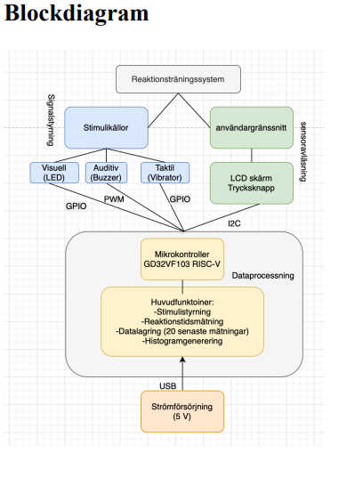
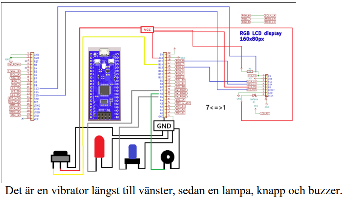
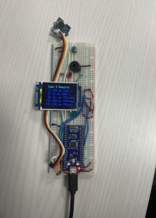
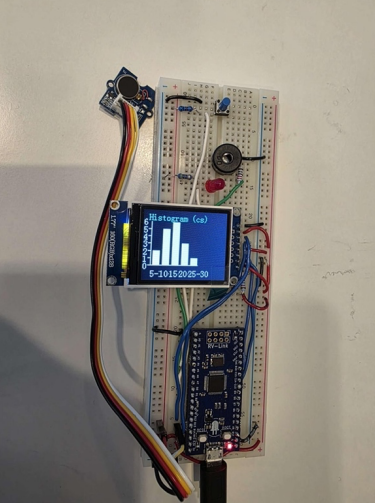

# Reaction-Time-Training-System
This project is an embedded system that measures human reaction time using different types of stimuli. The system combines electronics, programming, and measurement technology to test how quickly a user reacts to a signal.

The project uses three different types of signals:

- Visual signal using an LED
- Sound signal using a buzzer
- Tactile signal using a vibrator

When a signal is activated, the user should press a button as quickly as possible. The microcontroller measures the reaction time and displays the result on an LCD screen. The results can then be presented visually, for example as history or a histogram.

---

## Purpose

The purpose of the project is to create a portable and user-friendly system for measuring and analyzing reaction ability. The system can be used for training, demonstration, or as a technical example of how electronics and programming can be combined in an interactive measurement system.

---

## Function

The system works as follows:

1. The user starts the system.
2. The LCD screen shows that the system is ready.
3. A random waiting time is used so that the user cannot predict when the signal will appear.
4. The system activates one of three signals: LED, buzzer, or vibrator.
5. The user presses the button as quickly as possible.
6. The microcontroller measures the reaction time.
7. The result is displayed on the LCD screen.
8. Multiple results can be saved and displayed as history or as a histogram.

---

## Hardware

The project consists of the following components:

- GD32VF103 RISC-V microcontroller
- LCD screen
- Push button
- LED
- Buzzer
- Vibration motor
- Breadboard
- USB power supply, 5 V

---

## Software

The software is written in C and runs on a GD32VF103 RISC-V-based microcontroller.

The most important files are:

| File | Description |
|---|---|
| `main.c` | The main program that controls the test flow |
| `lcd.c` / `lcd.h` | Functions for the LCD screen |
| `pwm.c` / `pwm.h` | PWM control for the buzzer |
| `vibrator.c` / `vibrator.h` | Control of the vibrator |
| `oledfont.h` | Font data for the LCD screen |
| `Makefile` | Build file for compilation |

---

## Block Diagram

The block diagram shows how the different parts of the system interact.

---

## Flowchart

The flowchart shows the program logic from startup to measurement and result display.

---

## Circuit Diagram

The circuit diagram shows how the components are connected to the microcontroller.

---

## Prototype

Below is the finished prototype built on a breadboard.

---

## Example of Use

1. Connect the microcontroller via USB.
2. Wait until the LCD screen shows that the system is ready.
3. React as quickly as possible when the LED, buzzer, or vibrator is activated.
4. Press the button.
5. Read the reaction time on the LCD screen.
6. Repeat the test to collect more results.

---

## Result

The system displays the user’s reaction time directly on the LCD screen. After several attempts, the results can be presented as a summary, for example as history or as a histogram. This makes it easier to compare different reaction times over time.
